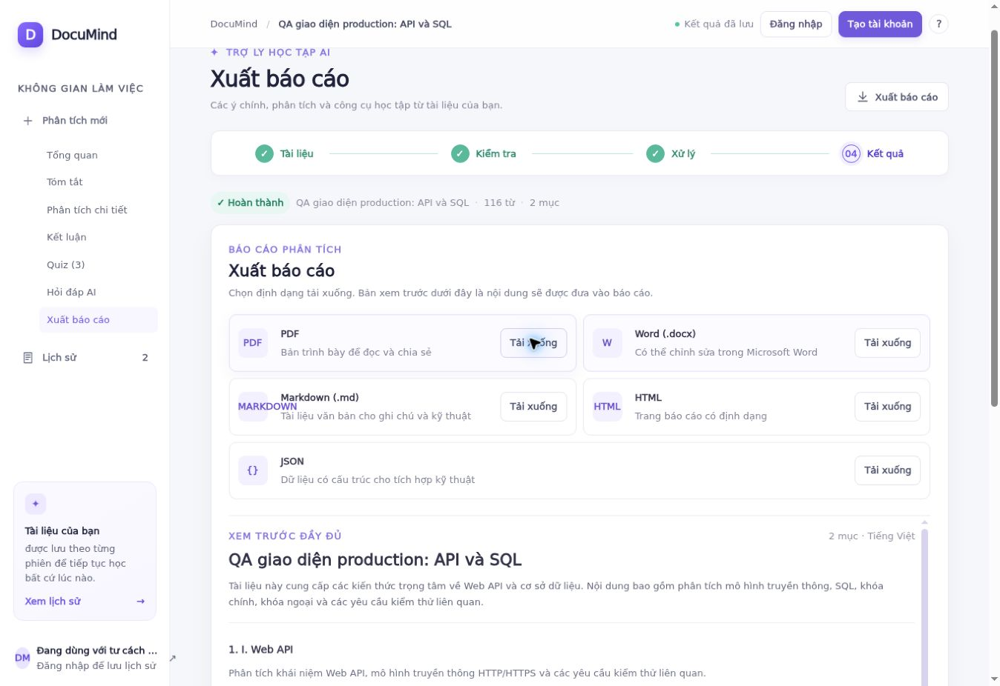

# DocuMind — cập nhật theo báo cáo bổ sung ngày 02/10/2026

## Căn cứ và phạm vi

Đợt này đọc toàn bộ `docs/danh_gia_cai_tien_2026-10-02.md` và `docs/giai_thich_luong_chuc_nang.md`, đồng bộ hai commit mới của chủ dự án trước khi sửa. Giữ các sửa đổi mock OCR/quiz, chuẩn hóa văn bản, lịch sử, chat, quiz và DetailView đã bổ sung. Không suy đoán rằng đã kiểm chứng đối chiếu Figma trực tiếp khi Figma không truy cập được.

Luồng giữ nguyên: **nhập → đọc/trích xuất có checkpoint → kiểm tra và chỉnh sửa → xác nhận → phân tích theo chunk → tạo quiz theo đợt → tổng hợp → kết quả/chat/quiz/xuất**. Danh mục và prompt tiếp tục ưu tiên IT; ngoài IT dùng fallback chung. Giao diện hiện hỗ trợ tiếng Việt.

## Thay đổi theo từng trang/chức năng

| Trang/chức năng | Đã cập nhật | Kiểm chứng và giới hạn |
| --- | --- | --- |
| Nhập | Tách InputScreen; cấu hình quiz 1–100 câu, độ khó, trắc nghiệm/đúng-sai/kết hợp; dùng danh sách tệp chung; bổ sung MIME cho CSV/log/C# | Unit kiểm tra mọi đuôi quảng bá có MIME tương ứng; e2e kiểm tra tệp không hỗ trợ và tệp rỗng. Không hỗ trợ `.doc` cũ. |
| Kiểm tra | Tách ReviewScreen; nhãn có sửa đổi chưa lưu; chế độ đọc/chỉnh sửa; đối chiếu bản gốc ảnh/PDF, link mở Word | Trình duyệt production đã thấy Mermaid và LaTeX đúng vị trí trong bản đọc; chỉnh sửa đổi nhãn và lưu thành công. Word mở ngoài bằng ứng dụng đọc tài liệu. |
| Cấu trúc tài liệu | Giữ bộ nhận diện đề mục và gom phần ngắn; không đổi đề mục thành số lần gọi AI | Test Gemini thật: 20.837 ký tự, bốn đề mục I–IV, bốn chunk theo bốn chương; các kiểm thử cấu trúc dài cũ vẫn chạy trong bộ unit. |
| Xử lý | Tách ProcessingScreen; reducer quản lý screen/analysis/progress; vòng lặp hữu hạn, retry có backoff, Retry-After, AbortController | Giữ checkpoint; pause dừng gửi yêu cầu tiếp theo, không cam kết hủy tác vụ đang chạy trên server. Sửa lỗi response bị mất/đã hoàn tất nhưng UI quay lại Review. |
| Tổng quan/tóm tắt | Giữ tổng quan và highlight có tiêu đề; thêm thống kê token/lượt gọi/độ trễ theo phiên | Không hiển thị số tiền giả. Thời gian gọi LLM không đồng nghĩa tổng thời gian người dùng chờ, vì còn DB/mạng/các bước khác. |
| Chi tiết | Giữ tìm kiếm không dấu, mục lục, mở/thu gọn; phân biệt list/JSON kỹ thuật/Mermaid/LaTeX/table | Khi thử dữ liệu Gemini thật, bắt thêm lỗi `type=list, contentType=json` bị hiện raw JSON. Đã chuẩn hóa list có kiểu riêng; UI và xuất file đọc được cả dữ liệu cũ. JSON kỹ thuật thật vẫn được đánh dấu và render dưới dạng dữ liệu. |
| Quiz | Quota theo độ dài chunk; tối đa 20 ứng viên/lượt gọi; checkpoint từng đợt; lọc loại/độ khó, loại trùng, giới hạn retry; lịch sử lượt nộp và ôn câu sai | Test bộ điều phối: 100 câu được tạo qua năm lượt provider mô phỏng độc lập. Test Gemini thật yêu cầu 100 → 96 câu hợp lệ, ghi `shortfall=4`; không bịa hoặc nhân bản câu để đủ số. |
| Chat | Xếp hạng đoạn liên quan trong toàn bộ kết quả và nguồn, ngữ cảnh JSON hoàn chỉnh, trích dẫn chỉ từ đoạn đã truy xuất | Gemini thật trả `operation_99(2)=101` và dẫn chương IV, nằm ngoài phần đầu tài liệu. Retrieval là từ khóa/BM25 đơn giản, chưa dùng embedding; câu hỏi nhiều tầng vẫn có thể bỏ sót ngữ cảnh. |
| Báo cáo | Xem trước tất cả mục và block; tải qua blob; sửa nhãn list để không nhầm JSON | API thật xuất PDF/Word/Markdown/HTML/JSON đều 200; PDF 6 trang A4, Word chứa chương cuối, 3 bảng và 3 ảnh. Unit kiểm chứng bảng/ảnh/formula/native export; e2e xác nhận thao tác tải qua browser với fixture. |
| Lịch sử | Tách HistoryScreen; giữ tìm/lọc và phục hồi cấu hình đã lưu | Phiên đã xác nhận tiếp tục chạy; phiên hoàn tất mở kết quả. Không coi khách là tài khoản có lịch sử vĩnh viễn. |
| Đăng nhập/đăng ký | Giữ Supabase Auth và AuthDialog đã có | Đợt này không tạo tài khoản mới hoặc đổi credential người dùng. Kiểm thử Auth validation chạy trong unit; không tuyên bố đã kiểm chứng email xác nhận/khôi phục mật khẩu thực tế. |
| Responsive/khả năng tiếp cận | Tách token màu, định dạng CSS, bỏ các cỡ chữ 7–12px trên UI; tăng tương phản màu phụ; SVG icon chính; tablist/tab, mũi tên/Home/End cả desktop và mobile | CI có 1360px và 390px, kiểm tra không tràn ngang và điều hướng bàn phím. Không đồng nghĩa đã audit WCAG đầy đủ mọi màu/trạng thái. |

## Backend, database và vận hành

- Gemini key gửi bằng header `x-goog-api-key`, không gắn URL. Timeout/lỗi mạng và response không phải JSON được chuyển thành lỗi có kiểu, có thông báo an toàn.
- Distributed quota bằng Postgres RPC; mỗi identity và mạng khách có bộ đếm dùng chung giữa các Vercel Function. Không lưu địa chỉ IP nguyên văn. Chat 20/phút; create 15/giờ; export 20/phút; run/ingest/quiz 120/phút; nhóm khách cùng mạng 240 yêu cầu/giờ. 429 có Retry-After; quota không truy cập được thì trả 503, không cho gọi AI tiếp.
- Lease riêng cho quiz và tổng hợp cuối để tránh hai tab cùng làm một lượt. Run của phiên đã hoàn tất trả trạng thái hoàn tất, không phân tích lại.
- Request/response LLM mới mặc định lưu hash và số ký tự thay vì nội dung tài liệu. Vẫn giữ token/latency/trạng thái. Log cũ trước bản cập nhật không tự động bị ghi đè; cron xóa theo TTL 30 ngày. `LLM_LOG_CONTENT=true` là tùy chọn chẩn đoán có chủ đích.
- Cleanup xóa cả asset Storage của phiên khách hết hạn; khi không đọc được danh sách đường dẫn thì không xóa phiên để tránh tạo tệp mồ côi.
- CSP dùng nonce cho script, chặn object/frame ngoại, chỉ cho nguồn Supabase phù hợp; font UI lấy file nội bộ. Kiểm tra HTML production có CSP và script nonce tương ứng, không có key Gemini.
- Endpoint `/metrics` và `/quiz/attempts` GET kiểm tra chủ sở hữu trước khi trả dữ liệu. Thống kê không chứa prompt hoặc đáp án.

Đã áp dụng **hai migration** vào project hiện tại:

1. `database/05_production_controls.sql` và migration tương ứng: `api_rate_limits`, RPC `consume_api_quota`, `analyses.quiz_settings`, `analysis_chunks.quiz_finished/quiz_batches/quiz_lease_until`.
2. `database/06_finalization_lease.sql`: `analyses.finalization_lease_until`.

Khi chuyển project production mới, chạy đầy đủ các file database theo `database/README.md`. RPC không được anon/authenticated gọi; service role có quyền. Đã kiểm tra trường mới, quyền và tình huống quota chấp nhận → từ chối → reset sau hết hạn trong transaction rollback.

## Kết quả kiểm thử

### Unit/build

- 103 unit test đạt, gồm bộ 72 test có sẵn và các test mới cho retrieval, privacy, Gemini transport, quota, quiz 100, pause/recovery và semantic list/JSON.
- TypeScript sạch; lint không có error, còn hai cảnh báo `` cho ảnh private/signed URL. Build Next.js thành công trong CI.
- 8/8 test CI Playwright đạt trên desktop/mobile với API fixture: flow tuần tự, Mermaid SVG, KaTeX, quiz/chấm/lịch sử, chat/trích dẫn, report preview/download, đầu vào không hợp lệ, bàn phím và overflow. Bổ sung case mất response khi pause nhưng server đã hoàn tất.

### Production Gemini/Supabase thật

Tài liệu IT **synthetic** được tạo riêng để kiểm thử, không phải tài liệu thật của người dùng:

| Bằng chứng | Kết quả |
| --- | --- |
| Đầu vào | 20.837 ký tự, I–IV; bốn chunk |
| Xử lý | 17 lượt `/run`; checkpoint phân tích và quiz lưu trên DB |
| LLM | 21 lượt gọi, không lượt lỗi; 42.137 input token, 20.384 output token; tổng latency LLM 61,758 giây |
| Thời gian các HTTP request | Khoảng 214,5 giây tổng cộng, bao gồm DB/mạng/các bước API |
| Quiz | Yêu cầu 100, thực tế 96; cả multiple_choice và true_false; shortfall 4 |
| Chấm/lịch sử | Nộp bài và GET lịch sử thành công |
| Chat chương cuối | Trả đúng 101 và dẫn chương IV/source chunk |
| Log privacy | 21/21 request và response đã redacted; không lượt failed |
| Xuất | 5/5 định dạng 200 và signed download 200; không có 500 trong chuỗi kiểm thử này |

Ngoài API, trình duyệt production thực hiện nhập → Review → xem sơ đồ/công thức → sửa văn bản → lưu → xác nhận. Việc pause cuối luồng đã giúp phát hiện và sửa lỗi đồng bộ trạng thái đã nêu trên.

Không suy rộng “không có 500 trong các test” thành “không thể có lỗi server”. Không tuyên bố rằng mọi file của mọi người dùng đã được kiểm thử, OCR luôn chính xác hoặc Gemini không thể hallucinate.

## Các điểm chưa đưa vào phạm vi hoàn tất

- **Dark mode/i18n** trong mục 17 của báo cáo là mở rộng UI; hiện vẫn một giao diện sáng, tiếng Việt. Chưa gắn nhãn “đã hỗ trợ”.
- **Confidence OCR từng vùng**: chưa có dữ liệu độ tin cậy được hiệu chỉnh; giữ cảnh báo và đối chiếu bản gốc, không tự tạo tỷ lệ tin cậy giả. Với PDF hiện đối chiếu trang gốc, chưa có overlay bounding-box từng vùng.
- **Figma**: chưa có phiên truy cập để xác nhận pixel/typography trực tiếp. Các thay đổi bám bố cục hiện tại và báo cáo, không ghi “đã khớp Figma”.
- **Leaked Password Protection** còn tắt theo Supabase advisor (cảnh báo có trước); tính năng phụ thuộc cấu hình/gói Auth. Tham khảo: https://supabase.com/docs/guides/auth/password-security#password-strength-and-leaked-password-protection.
- Advisor INFO của `api_rate_limits` không có policy là có chủ đích: bảng backend-only, RLS bật, anon/authenticated bị revoke, service role dùng RPC. Tham khảo: https://supabase.com/docs/guides/database/database-linter?lint=0008_rls_enabled_no_policy.
- Các INFO unused index không bị xóa chỉ vì chưa dùng trong giai đoạn traffic thấp: nhiều index phục vụ FK/cleanup. Tham khảo: https://supabase.com/docs/guides/database/database-linter?lint=0005_unused_index.
- Chưa tính chi phí tiền theo bảng giá model và chưa audit trực quan bằng Microsoft Word. Test e2e fixture kiểm tra UI, không thay thế test live provider.

Bản này là một đợt cập nhật và kiểm chứng có bằng chứng; không coi số test xanh là cam kết mọi đầu vào hay mọi điều kiện production đều đã được bao phủ.

## Xác nhận bản deploy cuối

- Commit code `09f1d4b21bf48aaba86e465afe5527e41ec8b421`: GitHub Actions run `37021586470` thành công (103 unit test, build, 8 e2e); Vercel báo success.
- Sau deploy đã xuất lại các định dạng; PDF hiển thị nhãn DANH SÁCH đúng, không nhầm danh sách thành JSON.
- Đã xem trang kết quả thật: mục lục thu gọn, danh sách, Mermaid SVG và KaTeX; báo cáo xem trước có cả hai chương. Không có console error/warn trong phiên browser kiểm tra này.
- Thử bắt sự kiện tải PDF trên cloud browser bị timeout ở công cụ điều khiển; không xác nhận đã nhận tệp qua browser này. API tạo và tải file thật thành công, và e2e tải file qua browser fixture đạt. Đây là giới hạn kiểm chứng còn lại, không được thay bằng khẳng định download production đã kiểm chứng đầy đủ.

