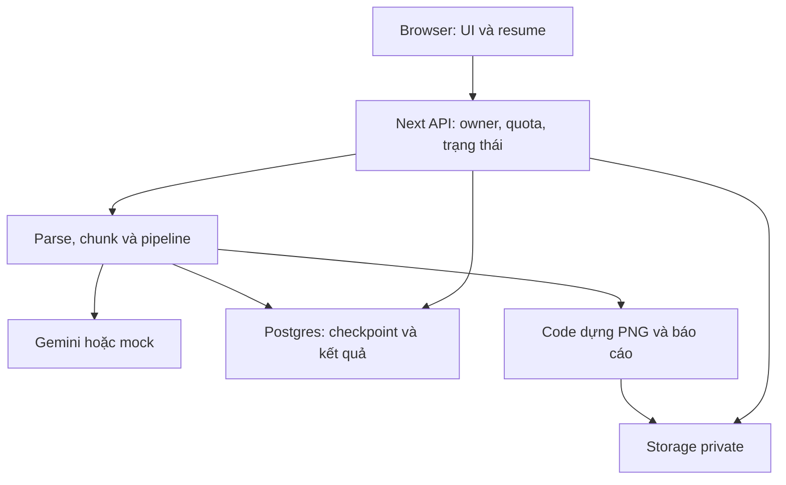
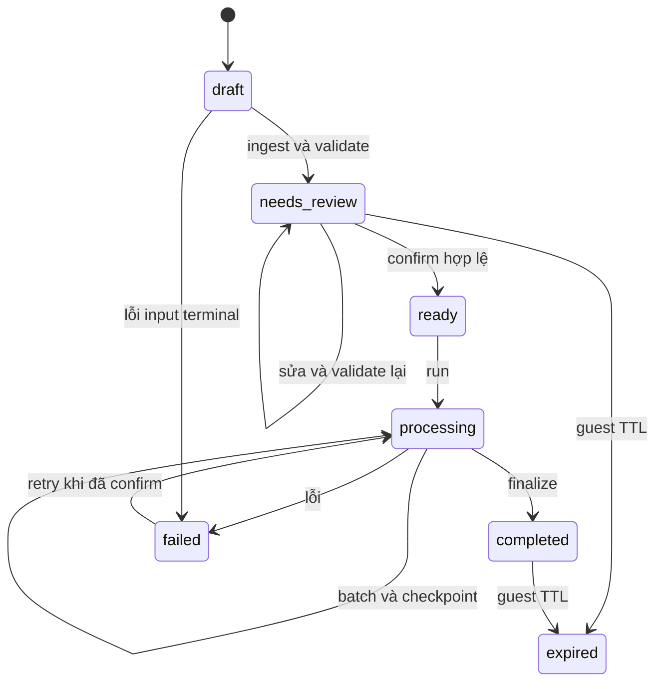
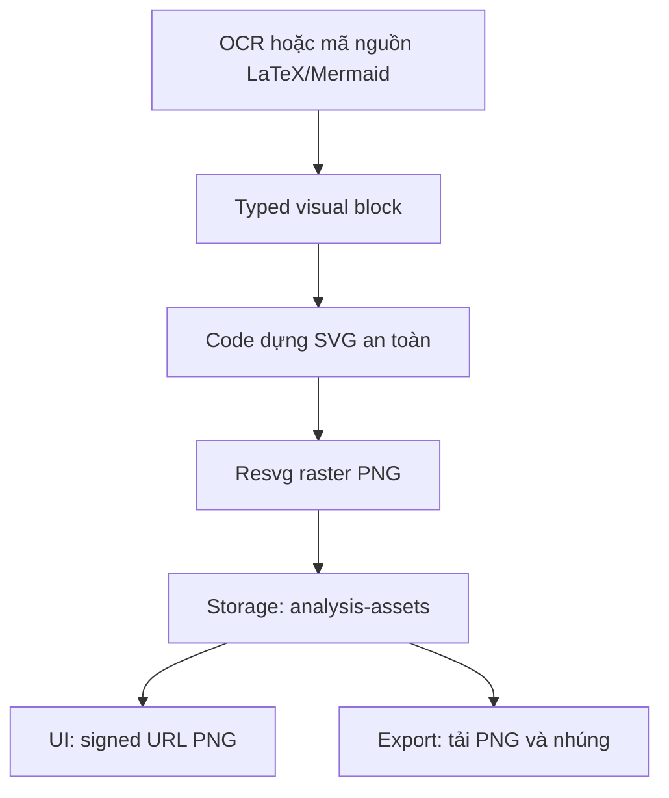

# DocuMind — luồng code và tài liệu trình bày cho giám khảo

Đối chiếu source commit `d76e57f5e2fb3c32c54276bd28ac0415dc816a43` và database đang chạy ngày 03/10/2026. Nội dung dưới mô tả code thực tế. DocuMind tập trung tài liệu IT; phần tài chính trong Figma là nội dung minh họa, không phải nghiệp vụ sản phẩm.

## 1. Bài toán và kiến trúc

DocuMind biến tài liệu dài thành một không gian học tập: đọc nguồn → kiểm tra và chỉnh sửa → xác nhận → phân tích → tổng quan, tóm tắt theo mục, nội dung chi tiết, quiz, chat và báo cáo. Cấu trúc hiển thị và đơn vị gửi AI là hai đối tượng khác nhau: mục ngắn có thể gộp, mục dài có thể tách theo mục con.

| Lớp | File chính | Trách nhiệm |
| --- | --- | --- |
| UI | `src/app/page.tsx`, `src/components/workspace/*`, `src/hooks/use-workspace.tsx` | Form, tìm kiếm ngành, review, chuyển trang, tiếp tục xử lý, lịch sử, quiz/chat/export. |
| Hợp đồng dữ liệu | `validation.ts`, `result-content.ts`, `quiz-settings.ts`, `http.ts` | Kiểm request/result, typed blocks, quiz settings, response và lỗi. |
| API | `src/app/api/**/route.ts` | Kiểm identity, owner, quota, trạng thái; gọi lib và DB. |
| Đọc nguồn | `documents.ts`, `ordered-extraction.ts`, `tables.ts`, `source-content.ts` | Parse/OCR theo thứ tự, normalize, outline, chunk và giữ visual nguồn. |
| Điều phối AI | `pipeline.ts`, `llm.ts`, `gemini-routing.ts`, `model-health.ts` | Chọn prompt/model, checkpoint, schema/repair, tổng hợp và quiz. |
| Render/xuất | `visual-assets.ts`, `visual-renderer.ts`, `formula.ts`, `svg-raster.ts`, `report.ts` | PNG, Storage, signed URL, PDF/DOCX/HTML/Markdown ZIP/JSON. |
| Hạ tầng | Supabase Auth/Postgres/Storage; Next.js trên local/Vercel | Tài khoản/session, bảng/RLS, file và HTTP runtime. |

Không có Edge Function hoặc database trigger gọi Gemini. AI chạy trong Node.js API của Next.js. Trigger tạo hồ sơ/cập nhật timestamp; RPC xử lý quota/circuit breaker.



## 2. Database: 19 bảng ứng dụng ở public

| Bảng | Liên kết chính | Nội dung/thời điểm ghi |
| --- | --- | --- |
| `profiles` | PK id tham chiếu auth.users.id | Tên, username, avatar; trigger tạo account và API profile cập nhật. Không lưu mật khẩu. |
| `topics` | Unique code | Chủ đề IT active và metadata catalog. |
| `topic_specializations` | topic_id; parent_id tự tham chiếu | 73 ngành/nhánh active, slug và cây phân cấp. |
| `prompt_templates` | purpose/topic/specialization/version | system prompt, user template, output schema, model config; loadPrompt chọn bản active. |
| `validation_rules` | Unique code | 7 rule active theo stage/severity/config; code bổ sung kiểm định nội dung thực tế. |
| `analyses` | user_id hoặc guest_session_hash | Cấu hình, status, validation, lỗi, confirmed_at, quiz_settings, TTL và finalization lease. |
| `analysis_inputs` | analysis_id | File gốc/path/size, original/normalized/edited text, extractionProgress, validation và ingest lease. |
| `analysis_chunks` | analysis_id/input_id | Nội dung/tiêu đề/index/char offsets, status/retry/generated_content và checkpoint/lease quiz. |
| `llm_exchanges` | analysis_id/chunk_id/prompt_template_id | Purpose/model/status/token/latency và payload theo chế độ privacy. |
| `analysis_results` | analysis_id/version | result_json, schema version, summary, source metadata, is_current. |
| `generated_assets` | analysis_id/result_id | Loại/source/path ảnh, kích thước và renderer; không lưu base64 ảnh. |
| `quizzes` | analysis_id/result_id | Tiêu đề, settings, trạng thái, số câu yêu cầu/thực nhận/shortfall. |
| `quiz_questions` | quiz_id/source_chunk_id | Câu hỏi/options/answer/explanation/difficulty/type/index; answer chỉ server đọc. |
| `quiz_attempts` | quiz_id/user_id hoặc guest hash | Answers, điểm, tổng câu, trạng thái và thời điểm làm/nộp. |
| `chat_messages` | analysis_id | Role/content/citations/metadata/history. |
| `exports` | analysis_id/result_id | Định dạng/status/path artifact đã lưu. |
| `api_rate_limits` | PK key_hash | Hits/cửa sổ/expiry; quota dùng chung giữa các Function. |
| `analysis_activity` | analysis_id | actor ai/system, label/model/status/thời điểm; log hiển thị liên tục. |
| `gemini_model_health` | PK scope hash API key + model | Failures/generation/open_until/probe_until/last_status cho circuit breaker. |

Supabase quản lý email/mật khẩu hash/session trong schema `auth`; `profiles.id` gắn với `auth.users.id`. Supabase quản lý bucket/object metadata trong schema `storage`; file thực ở Storage. Không chuyển hai schema hệ thống này sang public. FK cascade dọn bản ghi con; Storage file phải được code dọn riêng.

Seed cài mới: **1 IT active, 73 ngành active, 43 prompt active, 7 rule active**. Có topic/version cũ inactive do lịch sử migration; UI chỉ đọc active. SQL không chứa tài khoản, tài liệu, phiên, báo cáo, log hay secret của project cũ.

## 3. Auth và quyền sở hữu

### Đăng ký không xác nhận email

`AuthDialog.submit` → POST `/api/auth/register` → Zod strict và `validateSignUp` → quota theo hash email/địa chỉ mạng → server `auth.admin.createUser({email,password,email_confirm:true,user_metadata:{display_name}})` → trigger `on_auth_user_created` tạo profile → response201 → browser `signInWithPassword` → session → đóng dialog.

Browser chỉ dùng publishable key, server giữ service role. Request không nhận role/admin. Endpoint chỉ tạo account mới, không thay password hoặc kích hoạt account cũ đã tồn tại. Email được chấp nhận như thông tin người dùng khai báo; trạng thái confirmed cho phép đăng nhập không phải chứng cứ đã xác minh mailbox. Không lưu/log password trong bảng public hoặc response.

### Login và guest

`getSupabaseAccessToken` lấy session token; `getIdentity` dùng `auth.getUser(token)` kiểm user. Nếu không có bearer, đọc cookie `dm_guest`; khi tạo guest, token random32bytes và DB chỉ lưu SHA256. `ownerFilter` chọn user_id hoặc guest hash; `getAnalysis` áp owner, không thấy trả404, hết TTL trả410.

Guest có DB/history tạm để phục hồi, mặc định24h. Cookie HttpOnly/SameSiteLax và Secure trên production. Đăng nhập không tự nhập lịch sử guest vào account; hook giữ context guest của phiên đang làm. Phiên mới khi đã login gắn user_id. Logout `scope:'local'` gỡ session ở browser hiện tại.

## 4. API: route → hàm → dữ liệu

Route files ở `src/app/api/.../route.ts`; `[id]`/`[inputId]` là params động. Response thành công `{data:...}`, lỗi `{error:{code,message,requestId}}` qua `http.ts`. Các API theo phiên kiểm identity và owner trước truy cập dữ liệu.

| Method/path | Luồng chính | Đầu ra/DB |
| --- | --- | --- |
| POST `/api/auth/register` | strict schema → quota → admin.createUser | Account/profile mới;201; không token/secret. |
| GET/PATCH `/api/profile` | getIdentity → Auth/profile read hoặc profile update | Hồ sơ account owner. |
| GET `/api/health` | Trả INPUT_LIMITS/provider | Liveness; không ping DB/Gemini, không phải readiness toàn hệ thống. |
| GET `/api/topics` | Đọc active topics/specializations | Catalog có parent_id. |
| GET `/api/prompts` | Đọc metadata section_generation active | ID/tên/version/scope; không trả toàn system prompt qua route này. |
| POST `/api/analyses` | identity/quota → safeBody → tạo analysis/input | draft; signed upload plan hoặc text; lưu bản gốc. |
| GET `/api/analyses` | ownerFilter → history | Phiên của đúng identity. |
| GET `/api/analyses/{id}` | getAnalysis → status/inputs/chunks | Phục hồi review/processing/result. |
| POST `/ingest` | owner/quota/state → input lease → Storage.download → extractFileStep | extractionProgress/text; complete để frontend tiếp tục lặp. |
| POST `/validate` | normalize/outlineText/chunkText → locateIssue/inputIssueStatus | validation_report, status từng file, chunks pending; needs_review. |
| PATCH `/review` | Kiểm editable state → lưu edited_text → chia/validate lại | Giữ original/path, cập nhật cấu trúc. |
| POST `/confirm` | Kiểm needs_review/chunks/blockingErrors → conditional update | ready/confirmed_at; conflict409. |
| POST `/run` | quota → runAnalysis | Một batch chunk/quiz hoặc finalize; progress/waitMs/completed. |
| GET `/result` | owner → current result → attachVisualLinks | Typed JSON cho UI và PNG URLs có TTL. |
| GET `/activity` | owner → recent events | Tối đa40events, UI poll2.5s; không phải full audit export. |
| GET `/metrics` | owner → aggregate llm_exchanges | Calls/token/latency, tối đa2000rows/truncated; không phải chi phí hoặc toàn bộ OCR/fallback calls. |
| GET/POST `/quiz` | Trả câu hỏi an toàn; POST createQuizForAnalysis nếu cần | Chỉ completed/quiz enabled; GET không trả đáp án. |
| POST `/quiz/attempts` | owner → server đọc đáp án/chấm → insert attempt | Điểm/feedback, không tin điểm do client gửi. |
| GET/POST `/chat` | retrieveChatContext → loadPrompt → generateLlm | Message/citations, lưu conversation và exchange. |
| POST `/assets` | owner/current result → match source block → ensureVisualAsset | PNG metadata/path/signed URL. |
| POST `/exports` | completed → prepareReportImages(strict) → reportTo* → upload | exports row và download URL300s. |
| GET `/inputs/{inputId}/source` | owner/input cùng analysis → sign original | URL600s; bản gốc cũ thiếu file trả404. |
| GET `/api/cron/cleanup` | timingSafeEqual(CRON_SECRET) → files/DB cleanup | Dọn TTL/log/quota, không chạy AI. |

Các path từ `/ingest` đến `/inputs/.../source` có prefix `/api/analyses/{id}`. API xử lý status401/403/404/409/410/413/415/422/429/503 và message an toàn. Một số lỗi nội bộ vẫn có thể500; không tuyên bố hệ thống không bao giờ500.

## 5. Input, upload và đọc nguồn

`useWorkspace.createAnalysis` → API tạo phiên. Với file, server tạo metadata/signed upload, browser đưa bytes trực tiếp `analysis-inputs` rồi `completeFileUploadAndReview`/`ingestAllFiles` lặp `/ingest`. Không đưa file20MB qua JSON body của Vercel Function. Text dán cũng lưu TXT nguyên văn.

Ba phiên bản text: `original_text` giữ nguồn đọc được, `normalized_text` giữ bản chuẩn hóa, `edited_text` giữ sửa của người dùng. Đường dẫn Storage giữ file gốc; sửa review không sửa giả bản gốc.

Giới hạn mẫu:10files,20MiB/file,500k ký tự; PDF200pages,8MiB/media OCR,64MiB tổng media Word. Kiểm size/extension/signature cả client và server. Nâng giới hạn phải đối chiếu bucket/tài nguyên/quota.

| Đầu vào | Code đọc | Khi gọi AI | Cần biết |
| --- | --- | --- | --- |
| TXT/MD/source/JSON/XML… | TextDecoder/normalize, giữ source/fence | Phân tích sau confirm | UTF8; không hứa mọi encoding lạ đều đọc đúng. |
| CSV | parseDelimitedTable → markdownTable | Diễn giải bảng sau confirm | Giữ cell có quote/newline; bảng phức tạp vẫn cần review. |
| DOCX | prepareDocx đọc ZIP/XML theo thứ tự text/table/media/math/drawing | recognizeSource cho image/Office Math/drawing cần đọc | “Đơn vị” không phải số trang Word thực do layout reflow. |
| PDF + Gemini | preparePdf đọc số trang/tách page units | Từng trang, kể cả có text layer | Lựa chọn giữ hình/bảng/math, đổi lại quota/latency và sai số OCR. |
| PDF + mock | pdfParse đọc text layer | Sample OCR mock nếu scanned | Không chứng minh đọc hình thật. |
| PNG/JPEG | Kiểm signature/size | recognizeSource Vision | Illustration bỏ qua, có count/warning. |

Gemini Vision dùng chính model Gemini hỗ trợ media theo key/quota; không phải dịch vụ free độc lập. `media.base64Data` là transport trong HTTP tới Gemini/in-memory; yêu cầu không lưu base64 ảnh vào DB không cấm transport của provider.

`processExtractionUnit` xử lý text nội bộ, gặp image/math/drawing thì nhận dạng rồi ghép thông tin tại vị trí nguồn. Các unit độc lập có thể chạy song song nhưng output ghép theo index. Checkpoint lưu `nextUnit`, `totalUnits`, warnings, visual/skipped counts; không đưa mọi ảnh xuống cuối tài liệu.

`recognizeSource` trả schema `blocks[{kind,content}]`, gồm text/heading/code/table/latex/mermaid/description/illustration. `serializeSourceBlocks` chuyển LaTeX thành `$$...$$`, Mermaid thành fence, description thành chú thích; filter illustration. `preserveSourceVisuals` giữ visual nguồn khi kết quả AI bỏ sót. Nếu chỉ nhận dạng thành mô tả, không thể dựng chính xác hình gốc; UI có warning để đối chiếu.

**OCR có thể gọi AI trước confirm.** Confirm kiểm soát giai đoạn phân tích/quiz, không kiểm soát việc đọc PDF/ảnh đầu vào. Đây là khác biệt quan trọng khi mô tả sản phẩm.

## 6. Đề mục, mục con, chunk và Review

`normalizeText` chuẩn hóa whitespace; `detectHeadings`/`outlineText` xem heading rõ ràng, chuỗi thứ tự và ngữ cảnh. Không coi mọi dòng bắt đầu bằng số là tiêu đề. Roman I/II/III, alpha A/B/C, decimal được phân cấp theo cấu trúc; vùng mụcI kết thúc trước mụcII; children chứa các mục con thuộc khoảng đó.

Outline phục vụ người dùng. `chunkText` phục vụ giới hạn gửi AI: ưu tiên mục lớn; dài thì `splitLongSection` theo children/paragraph boundaries; ngắn thì gộp các phần phù hợp. Env mẫu: MAX_CHUNK_CHARS12000, MIN_MAJOR_SECTION_CHARS2500, CHUNK_OVERLAP_CHARS500. Một heading ngắn không bắt buộc một request; children vẫn hiện trong outline dù chung chunk.

Ví dụ mụcI dài20000 ký tự có1.1/1.2, mụcII300 ký tự, mụcIII8000 ký tự: I tách theo child/boundary trong giới hạn; II được pack cùng vùng phù hợp; III giữ đủ nội dung. Số request phụ thuộc độ dài/cấu trúc, không chỉ số tiêu đề. Không hứa gộp mọi sibling bất chấp hierarchy/size.

`/validate` ghi report/chunks và lỗi theo inputId/inputName/page/unit/location. PDF báo TrangN; DOCX báo Đơn vịN khi không có số trang layout đáng tin. `locateIssue` và `inputIssueStatus` tránh đánh dấu toàn bộ file lỗi khi chỉ một file lỗi. Nút warning mở/scroll tới nguồn tương ứng.

Review dùng accordion cây và text có thể chỉnh. `/review` lưu edited_text rồi tạo lại structure/chunks/report. UI phải tải report mới; không dùng cấu trúc cũ để confirm. Blocking error đỏ chặn xác nhận; warning vàng được chỉ rõ để người dùng quyết định sau review.

## 7. Trạng thái, Confirm và phục hồi F5



`validating` cũng có trong enum, là trạng thái trung gian khi validate đang làm việc; sơ đồ tập trung các checkpoint chính. Failed chưa confirm phải quay lại ingest/review, không được chạy analysis vượt confirm. TTL chặn truy cập ngay cả khi cron chưa xóa.

`confirmAndRun` trong hook: persistReviewChanges → validate → confirm → `resumableLoop` gọi `/run` tới completed. Retry phiên đã confirm không confirm/review lại gây409. `openHistoryItem`, `resumeState`, `workspaceFlow` chọn screen theo status/confirmed_at/extractionProgress. Draft thiếu dữ liệu không bị giả coi là result, không gọi flatMap trên undefined.

`runAnalysis` thực hiện:

1. `getAnalysis`, kiểm confirmed/status; completed trả idempotent completed.
2. Conditional update ready/failed thành processing, có owner/status filter.
3. Lấy edited → normalized → original theo ưu tiên; `resolveITSpecialization` dùng bằng chứng nguồn và lưu routing.
4. `loadSectionPrompt`/`loadPrompt` chọn chuyên ngành → topic → global, bản active/version cao nhất. Ngoài IT ghi general_fallback.
5. Claim nhóm pending/failed tối đa LLM_CONCURRENCY, default3/clamp4. Chunk complete có generated_content hợp lệ dùng lại; chunk processing stale quá300s mới reclaim.
6. `renderPrompt` → `invokeAndLog` → `generateLlm` → normalize/`assertResult`. JSON lỗi được một lần repair; giữ source visuals; lưu chunk complete/retry_count hoặc failed.
7. Còn chunk trả processing/progress. Xong chunk thì tiếp tục quiz candidate batches nếu bật.
8. Finalization lease180s chống hai tab tổng hợp trùng; `mergeChunkSections` theo nguồn/index; `synthesizeOverview` tạo lead/highlights, `fallbackOverview` khi overview không hợp lệ.
9. Validate toàn report → version analysis_results → `persistAssets` → `prepareReportImages(false)` → `generateQuiz` → completed.

Pipeline dựng visual non-strict để UI có thể fallback khi một ảnh chưa dựng; log task failed. Export dựng strict=true, không âm thầm xuất báo cáo thiếu ảnh. Finalize gồm nhiều DB writes được lease bảo vệ, không phải một transactionRPC lớn; crash giữa write vẫn cần retry/kiểm dữ liệu. Không tuyên bố exactly-once của distributed queue.

Ingest/chunk/quiz/finalization checkpoints nằm DB. F5 hoặc mở lịch sử khôi phục; chunk complete không sinh lại. **Không có worker tự chạy vô hạn sau khi đóng tab:** request đang chạy có thể xong, phần còn lại chờ mở/tiếp tục. `resumableLoop` giới hạn1200step/lượt UI, retry429/502/503/504 tối đa4 lỗi liên tiếp, có backoff/AbortSignal; hết giới hạn báo tiến độ đã lưu.

## 8. Gemini, prompt, depth và circuit breaker

`generateLlm` chọn mock/Gemini. `availableModels` gọi GET`/v1beta/models`, lọc model hỗ trợ generateContent, cache5phút theo hash key. Chỉ gọi model catalog hỗ trợ; không khẳng định mọi tên người dùng liệt kê tồn tại hoặc được cấp quyền. Key gửi header `x-goog-api-key`, không trong URL/log.

Thứ tự code mặc định: 3.5FlashLite →3.5Flash →3.8Flash →2.0Flash →2.0FlashLite →2.5Flash →2.5FlashLite →2.5Pro →3Flash →3.1Pro →3.1FlashLite →3.6Flash →3.7Flash. `GEMINI_MODEL` có thể ưu tiên đầu; `GEMINI_FALLBACK_MODELS` override danh sách. Preview alias chỉ dùng khi catalog thật có.

Trước mỗi model attempt, `modelHealthEvent` gọi `gemini_circuit_event(claim)`. Model open hoặc probe đang do request khác giữ: ghi system activity “bỏ qua model” rồi sang model tiếp. Lỗi429/5xx/404/network/empty/MAXTOKENS ghi failure một lần cho attempt; lỗi quyền403 kết thúc vì không thể sửa chỉ bằng đổi model. Có deadline tổng và timeout từng fetch; không loop vô hạn.

Circuit dùng hash key+model, row lock serialize:

- 5 lỗi **liên tiếp** mở cooldown300s; success khi closed reset counter.
- Generation tăng khi mở; completion từ thế hệ cũ không mở khóa nhầm.
- Hết5phút, claim đầu giữ probe lease90s; request khác skip.
- Probe thành công mở lại/reset, thất bại mở thêm300s; probe crash chờ lease hết.
- Health/quota DB unavailable trả503 fail closed, không quay về thử model đã khóa.

Depth quick/standard/deep thay instruction và `thinkingConfig` nếu model hỗ trợ: Gemini2.5 dùng thinkingBudget, Gemini3+ dùng thinkingLevel. Deep yêu cầu cơ chế/điều kiện/giới hạn/ví dụ có trong nguồn, không bịa để dài hơn. Model không hỗ trợ không nhận tham số đó. Phải đánh giá chất lượng với nguồn, không mặc định deep luôn tốt hơn.

Prompt DB phục vụ topic_detection, section_generation, quiz_generation, chat, repair. OCR system prompt nằm trong `ordered-extraction.ts`, overview instruction trong `pipeline.ts`, vẫn gọi adapter purpose document_ocr/overview_generation. Không phải mọi call đều đọc một prompt row. IT có prompt chuyên ngành; fallback chung giữ cùng hợp đồng output nhưng ít chuyên sâu hơn.

## 9. Hợp đồng typed result và UI

Ví dụ minh họa schema:

```json
{
  "title": "Độ phức tạp thuật toán",
  "summary": "Ý chính đã kiểm với nguồn.",
  "overview": {"lead":"Giải thích độ phức tạp.","highlights":[{"title":"Thời gian","detail":"So sánh theo đầu vào."}]},
  "sections": [{
    "title":"I. Khái niệm",
    "summary":"Tóm tắt riêng mục I.",
    "blocks":[
      {"type":"paragraph","content":"Nội dung từ nguồn."},
      {"type":"formula","contentType":"latex","content":"T(n)=n^2"},
      {"type":"diagram","contentType":"mermaid","content":"flowchart TD\nA[Input] --> B[Process]"},
      {"type":"table","contentType":"table","content":{"headers":["Loại","Giá trị"],"rows":[["Ví dụ","O(n)"]]}},
      {"type":"code","contentType":"code","content":"for(let i=0;i<n;i++){}","metadata":{"language":"javascript"}},
      {"type":"json","contentType":"json","content":{"example":true}}
    ]
  }],
  "metadata":{"promptScope":"it_specialized","sourceCount":1}
}
```

`normalizeBlock`/`normalizeResult` chuẩn shape; `assertResult`/Zod kiểm hợp đồng. `ResultBlockView` dispatch paragraph/list/table/code/json/visual. Object JSON phải đánh dấu type/contentTypejson; không rải object thành prose. Table có headers/rows; code có pre cuộn; markdown wrap từ dài. CSS min-width0/grid minmax0 tránh đẩy cả viewport.

Overview có lead/highlights với tiêu đề cụ thể; summary theo section có title riêng. Không nối toàn tài liệu thành một đoạn dài. metadata ghi sourceCount/chunkCount/promptScope; không suy nội dung từ tên file/nhãn phiên để bịa phạm vi.

## 10. Sơ đồ, công thức và PNG



`renderFormulaPng`: LaTeX → MathJax TeX base/AMS → SVG paths → Resvg PNG. Kiểm source/dimension/script/link; cache128 formulas trong process chỉ để tối ưu, Storage mới là persistence.

`renderVisual`: Mermaid qua beautiful-mermaid server, SVG được kiểm an toàn rồi raster với TTF. Các family server không hỗ trợ có browser Mermaid strict fallback; SVG gửi về asset API phải khớp block thuộc current result. Chặn external resource/script/foreignObject. PlantUML hiện chưa có renderer, trả422 rõ; cần chuyển Mermaid. Description không phải mã dựng lại hình gốc.

`ensureVisualAsset` tìm PNG hợp lệ theo analysis/result/kind/source; cần thì render/upload đường dẫn hash và lưu metadata. `prepareReportImages` dedupe, concurrency3. `attachVisualLinks` ký PNG3600s, chỉ thêm URL tạm vào response; DB giữ path/source/dimension, không base64.

| Format | Hàm | Ảnh/font/di động |
| --- | --- | --- |
| PDF | reportToPdf | PDFKit nhúng PNG và DocuMindSans.ttf; code phân trang/bảng. |
| DOCX | reportToDocx | ImageRun PNG trong word/media, giữ tỷ lệ; Unicode/font khai báo. Máy mở Word có thể substitute font chữ nếu không có font đó. |
| HTML | reportToHtml | Escape HTML và PNG data URI **trong file xuất**, không phải DB; ảnh mở offline. |
| Markdown | reportToMarkdownZip | ZIP chứa report.md và images relative; giải nén giữ cây thư mục. |
| JSON | JSON.stringify + attachVisualLinks | Typed content/source/path/dimensions; signed URLs có TTL, consumer cần cấp mới khi hết hạn. |

Không gọi AI để dựng HTML/PDF/Word. Code tạo từ resultJSON/PNG. `/exports` re-ensure PNG strict → upload analysis-exports → exports row → download URL300s. Nếu render ảnh lỗi phải báo, không xuất thành công giả. Signed URL input600s/asset3600s/export300s; file Storage vẫn tồn tại sau URL hết hạn.

## 11. Quiz và chatbot

`quizSettingsSchema` mặc định20, cho số nguyên dương tới JS safe integer; không fix100. `quizQuotas` phân bổ theo độ dài chunk và largest remainder để tổng đúng request. `continueQuizCandidates`/`continueQuizChunk` giữ candidates/checkpoint/quiz_finished/quiz_batches/lease; batch tối đa20, không một call tạo100.

Candidate được normalize/dedupe/lọc difficulty, shuffle option giữ đáp án. Tài liệu đủ có nhiều batch; thiếu câu unique thì settings ghi requestedQuestionCount/questionCount/shortfall, không nhân câu lặp. Fallback có điều kiện, không thay yêu cầu hard bằng câu dễ giả. Count cao vẫn chịu thời gian/quota và giới hạn loop/tài nguyên.

GETquiz không answer; POSTattempts server đọc answer/chấm/lưu. Không dùng score client làm nguồn đúng. Từng lượt chọn answer không gọi LLM lại.

Chat POST dùng history/nguồn và `retrieveChatContext` lấy chunk/section liên quan trong budget; prompt theo scope IT/general; trả answer/citations rồi lưu messages. Không đủ nguồn cần nói rõ. Retrieval hiện là lexical/ranked context, **không phải vector RAG/pgvector**, dù catalog có ngành LLM/RAG để học.

## 12. Trigger, RPC, RLS, logs và cron

| Cơ chế | Khi chạy | Tác dụng |
| --- | --- | --- |
| `on_auth_user_created` → `handle_new_user()` | AFTERINSERTauth.users | Tạo profiles theo id/metadata, ONCONFLICT tránh trùng. SECURITYDEFINER cần cho Auth write, search_path rỗng, revoke execute client. |
| `profiles_updated_at`, `topics_updated_at`, `specializations_updated_at`, `prompts_updated_at`, `validation_rules_updated_at`, `analyses_updated_at`, `inputs_updated_at`, `chunks_updated_at`, `quizzes_updated_at` → `set_updated_at()` | BEFOREUPDATE bảng tương ứng | new.updated_at=now(); không tự chuyển status hoặc gọi AI. Chunk reclaim dùng timestamp này. |
| `consume_api_quota(key,limit,window)` | Trước operation tốn tài nguyên/đăng ký | Atomic UPSERT, allowed/retry_after; hash key, service only, SECURITYINVOKER. |
| `gemini_circuit_event(scope,model,event,generation,status)` | Adapter claim/success/failure | Shared health, cooldown/probe/stale guard; service only, SECURITYINVOKER. |
| RLS + GRANT | Client/PostgREST truy cập | Catalog active và owner reads; state write qua API; answer/quota/activity/model health không direct client. |
| `startActivity`/`finishActivity` | Trước/sau AI hoặc internal task | actor/label/model/status để UI poll; không chain-of-thought hoặc copy toàn tài liệu. |
| `invokeAndLog`/`saveExchange` | Pipeline/quiz/overview calls | Exchange metadata/payload privacy; OCR không đi hết qua invokeAndLog nên metrics không đếm toàn bộ OCR. |
| Cleanup cron | Vercel schedule hoặc admin local gọi | Token constant-time; xóa guest files trước rồi DB cascade; dọn exchange30days/quota expired. |

Service role bypass RLS, vì vậy API owner checks bắt buộc. Log `LLM_LOG_CONTENT=false` mặc định hash/size; chỉ bật diagnostic content khi chủ động cần. Token/latency không phải cost calculator. `/activity` trả recent40, không phải audit vô hạn; mọi AI task có activity label nhưng không đồng nghĩa mọi model attempt/OCR đều có một llm_exchanges row.

## 13. Đánh giá từng trang và tiêu chí nghiệm thu

| Trang | Hành vi | Tiêu chí |
| --- | --- | --- |
| Input | Prompt/depth/topic/search ngành/files/text/quiz count | Valid range/size, tìm không có dùng auto, IT catalog. |
| Review | Text editable/outline/file gốc/warnings | Mục con đúng ranh giới, sửa→rechunk, đỏ chặn confirm, file/trang rõ. |
| Processing | Progress/chunk/quiz, AI/system logs, tiếp tục | F5/history/resume, lease, không completed giả. |
| Overview | Lead/highlights có tên và phạm vi nguồn | Không bịa từ tên phiên, không một đoạn dài. |
| Summary | Tiêu đề và tóm tắt từng section | Đủ ý, không raw JSON prose. |
| Details | Typed text/list/table/code/PNG | Readable, không overflow toàn màn hình. |
| Quiz | Count/type/difficulty/submit/feedback | Shortfall rõ, privacy answer và chấm server. |
| Chat | History/context/citations | Bám nguồn, message lỗi giữ retry. |
| Export | 5formats | PNG/font, portable ZIP/HTML, JSON explicit. |
| History | Status/filter/mở lại/file gốc | Owner/TTL, draft/failed không crash. |
| Auth/Profile | Register/login/logout/tên/username | Vào ngay không email, service key không ở client. |

Bộ này mô tả UI hiện có. Không tuyên bố pixel match ProductV2 hoặc đã kiểm lại Figma trong lượt này khi chưa có ảnh thiết kế truy cập được trong workspace.

## 14. Kịch bản demo 5–7 phút

1. 30giây: tài liệu IT dài có nhiều dạng dữ liệu; cần workspace dễ học.
2. 45giây: đăng ký không email, đưa tài liệu mẫu I/II/III có bảng/code/math/diagram; file gốc private.
3. 60giây: mở cây review, chỉ warning/vị trí, chỉnh text; phân biệt OCR trước confirm và phân tích sau confirm.
4. 60giây: confirm/process, log AI/nội bộ, F5 mở lại; giải thích checkpoint/chunk.
5. 60giây: overview highlights, summary theo mục, detail typed table/code/PNG.
6. 45giây: quiz20 hoặc100, chấm server; chat một câu có nguồn.
7. 45giây: PDF/DOCX/HTML cùng PNG, Markdown ZIP offline; SQL/seed tái triển khai và RLS/private Storage.

Chuẩn bị tài liệu đủ nội dung nhưng không quá lớn để tránh chờ quota lâu. Giữ báo cáo đã xuất và result đã lưu. Nếu dùng mock, nói rõ label mô phỏng; không trình bày sample OCR như đọc ảnh thật.

## 15. Trả lời giám khảo đúng với code

- **Mọi thứ đều AI?** Normalize/outline/chunk/table parse/schema validation/renderPNG/export/grade là code. OCR/analysis/overview/quiz generation/chat dùng Gemini hoặc mock.
- **PDF có chữ vẫn gửi AI?** Production đọc từng trang để giữ hình/bảng/math; đánh đổi quota/latency. Text-layer-only hiện ở mock; không nói đã có hybrid text-first production.
- **AI vẽ ảnh báo cáo?** AI trích/đề xuất Mermaid/LaTeX, code dựng/raster PNG và lưu Storage.
- **100 câu một request?** Quota theo chunk, batch20, checkpoint/dedupe/shortfall.
- **Đóng tab vẫn chạy tới cuối?** Không worker riêng; mở lại tiếp tục call loop. Request đang chạy có thể xong và checkpoint.
- **429 hoặc model lỗi?** Fallback theo catalog, shared circuit5failure/5min, single probe; skip model đang khóa.
- **Tại sao JSON?** Hợp đồng typed cho UI nhiều dạng, không raw JSON thay prose. JSON export riêng có nhãn.
- **Bảo vệ dữ liệu?** JWT/guest hash/owner/RLS/private buckets/signed URL; service key server, log redacted. Email không được xác minh ownership theo yêu cầu sản phẩm.
- **Giới hạn hiện tại?** OCR có sai số; mô tả hình không dựng được ảnh gốc; PlantUML chưa render; nguồn ngắn có shortfall; model quota/network; mock vẫn cần Supabase; chưa vector RAG/worker queue; các lỗi dependency vẫn cần quan sát. Không tuyên bố không bao giờ lỗi.

Tài liệu nền tảng đã đối chiếu: https://supabase.com/docs/reference/javascript/auth-admin-createuser và https://supabase.com/docs/guides/auth/passwords . Các chi tiết luồng còn lại lấy trực tiếp mã nguồn.
